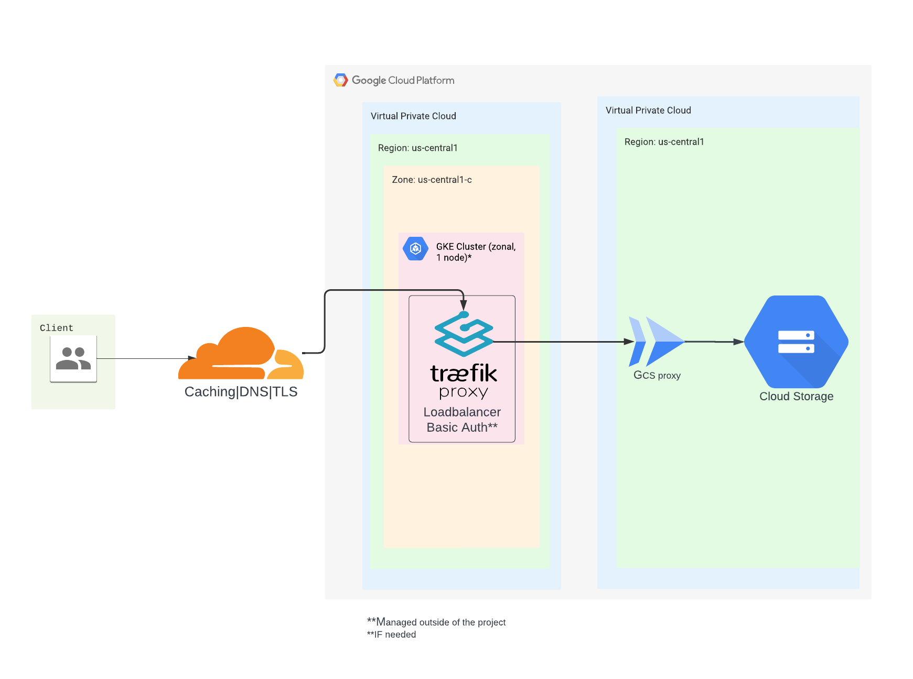

# My Cloud Resume
This repository contains the source code and files for my cloud resume, started as part of the Cloud Resume Challenge. My cloud resume is a web-based representation of my professional experience, skills, projects.

To view my cloud resume, simply visit the URL https://sergeichukh.cloud/resume.html.

## Architecture
This cloud resume is hosted on GCS, served via Cloudflare CDN and routing is managed via Traefik. All non-GCP infrastructure is managed by the GKE cluster. The deployment process is automated using GitHub Actions, which builds and deploys the code to the GCS bucket whenever changes are pushed to the production branch. Deployment is made via Pulumi.

Used instruments
- **Frontend**: HTML, CSS, JS.
- **Infrastructure**: GKE, Cloud Run, Traefik
- **CI/CD**: GitHub Actions, Pulumi

The brief diagram of the current infrastructure:

The most important topic about this project is the price. It costs about ~5$ per month (mostly for the GKE node's storage) and relies on the free tier. The architecture is not considered to be HA, but it aims to provide the SLA ~99,9% of availability.

### To do list
- **CRC**:
    - [ ] Gain certificate
    - [x] Make a resume
    - [x] Deploy
    - [x] Deploy Loadbalancer
    - [x] Use my own domain
    - [x] Use caching (Cloudflare)
    - [ ] Make an api service with the cloud functions
    - [ ] Store data in storage (cloud database/firestore)
    - [x] CI/CD (Github actions)
    - [x] IAC (Pulumi)
    - [ ] Make an article for challenge

- **autogeneration**:
    - [ ] Add a pdf generation

- **GKE**:
    - [ ] spot instance usage

## Contributing
If you'd like to contribute to this repository, feel free to create a pull request or open an issue. All contributions are welcome!

## License
This repository is licensed under the MIT License. All personal data belong to me.
