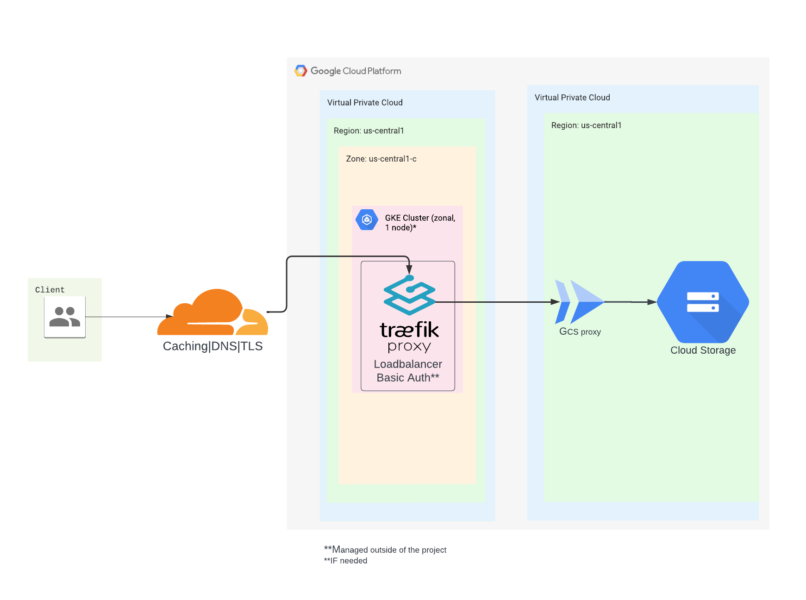

# My Cloud Resume

This repository contains the source code and files for my cloud resume. The project was started as part of the Cloud Resume Challenge and is a web-based representation of my professional experience, skills and projects.

To view my cloud resume, visit <https://sergeichukh.cloud/resume.html>.

### Building the resume

The resume HTML is generated from the data located under `resume/src`. Run the following command to rebuild `frontend/resume.html`:

```bash
yarn build:resume # or npm run build:resume
```

## Architecture

This cloud resume is hosted on GCS, served through Cloudflare CDN and the routing is handled by Traefik. All non-GCP infrastructure is deployed in the GKE cluster. The deployment process is automated using GitHub Actions, which builds and deploys the code to the GCS bucket whenever changes are pushed to the production branch. Deployment is handled via Pulumi.

Tools used

- **Frontend**: HTML, CSS, JS.
- **Infrastructure**: GKE, Cloud Run, Traefik
- **CI/CD**: GitHub Actions, Pulumi

The brief diagram of the current infrastructure:


The main consideration for this project is the cost. It runs for about ≈$5 per month (mostly for the GKE node storage) and relies on the free tier. The architecture is not designed for high availability but aims to provide approximately 99.9% uptime.

### To do list

- **CRC**:
  - [ ] Obtain the certificate
  - [x] Make a resume
  - [x] Deploy
  - [x] Deploy Loadbalancer
  - [x] Use my own domain
  - [x] Use caching (Cloudflare)
  - [ ] Make an api service with the cloud functions
  - [ ] Store data in storage (cloud database/firestore)
  - [x] CI/CD (GitHub Actions)
  - [x] IAC (Pulumi)
  - [ ] Make an article for challenge

- **autogeneration**:
  - [x] Add a pdf generation

## License

This repository is licensed under the MIT License. All personal data belong to me.
